# 🏗️ BugHunter Architecture Documentation

This document provides detailed architecture diagrams and explanations for the BugHunter Agent system.

## System Overview

BugHunter is built on a **LangGraph StateGraph** architecture that orchestrates multiple AI-powered services to automate the bug fixing process. The system follows a state machine pattern where each node processes data and passes state to the next node.

## Component Diagram


## Detailed Workflow Flow

```mermaid
graph TD
    START([User Starts Investigation]) --> FETCH[Fetch Sentry Issues]
    FETCH --> SELECT[Select Issue]
    SELECT --> INIT[Initialize AgentState]
    
    INIT --> N1[NODE 1: sentry_analysis]
    
    N1 --> FETCH_SENTRY[Fetch Error Details<br/>from Sentry API]
    FETCH_SENTRY --> ANALYZE[Analyze Error Data<br/>- Type<br/>- Message<br/>- Stack Trace]
    
    ANALYZE --> BROWSER_TASK[Browser Automation Task]
    BROWSER_TASK --> NAVIGATE[Navigate GitHub Repo]
    NAVIGATE --> FIND[Find Relevant Files]
    FIND --> EXTRACT[Extract File Paths<br/>Line Numbers<br/>Reasons]
    
    EXTRACT --> N2[NODE 2: propose_fix]
    
    N2 --> BUILD_PROMPT[Build Gemini Prompt<br/>with Error + Files]
    BUILD_PROMPT --> CALL_GEMINI[Call Google Gemini<br/>2.5 Flash]
    CALL_GEMINI --> PARSE_FIX[Parse Proposed Fix<br/>- File Path<br/>- Fixed Code<br/>- PR Title/Description]
    
    PARSE_FIX --> N3[NODE 3: daytona]
    
    N3 --> CREATE_SANDBOX[Create Daytona Sandbox]
    CREATE_SANDBOX --> CLONE[Clone Repository]
    CLONE --> APPLY[Apply Fix to File]
    APPLY --> INSTALL[Install Dependencies]
    INSTALL --> RUN[Run Application/Tests]
    RUN --> RESULT{Test Results}
    
    RESULT -->|Success ✅| N4[NODE 4: approval]
    RESULT -->|Failure ❌| N4
    
    N4 --> DISPLAY[Display Results in UI]
    DISPLAY --> USER_DECISION{User Decision}
    
    USER_DECISION -->|Approve ✅| N5[NODE 5: create_pr]
    USER_DECISION -->|Reject ❌| STOP([Workflow Stopped])
    
    N5 --> CREATE_BRANCH[Create GitHub Branch]
    CREATE_BRANCH --> COMMIT[Create Empty Commit]
    COMMIT --> CREATE_PR[Create Draft PR<br/>with Title & Description]
    CREATE_PR --> END([PR Created ✅])
    
    style START fill:#90ee90
    style END fill:#90ee90
    style STOP fill:#ff6b6b
    style N1 fill:#4ecdc4
    style N2 fill:#4ecdc4
    style N3 fill:#4ecdc4
    style N4 fill:#4ecdc4
    style N5 fill:#4ecdc4
    style RESULT fill:#ffe66d
    style USER_DECISION fill:#ffe66d
```



## Data Flow Diagram


## State Schema

The `AgentState` TypedDict contains the following fields:

```python
class AgentState(TypedDict):
    error_id: str                    # Sentry error identifier
    sentry_data: dict                # Full Sentry error event data
    repo_url: str                    # GitHub repository URL
    workspace_id: str                # Daytona sandbox ID
    reproduction_steps: str          # Test execution results
    proposed_fix: str                # Gemini-generated fix with code
    github_issues: list              # Related GitHub issues (future use)
    final_pr_url: str                # Created PR URL
    pr_number: int                   # PR number
    messages: list                   # Log messages
    needs_approval: bool             # Approval flag
    relevant_files: dict             # Files identified by browser_use
```

## Integration Points

### 1. Sentry Integration
- **Purpose**: Fetch error details and stack traces
- **Methods**: 
  - `get_sentry_issues()` - List unresolved issues
  - `get_sentry_error()` - Get detailed error event data
- **Data Extracted**: Error type, message, stack trace, metadata

### 2. Browser Automation (browser_use)
- **Purpose**: Intelligently navigate GitHub to find relevant files
- **LLM**: Google Gemini 2.5 Flash
- **Methods**: `find_files_from_sentry_issue()`
- **Output**: JSON with file paths, line numbers, and reasons

### 3. Google Gemini Integration
- **Purpose**: Analyze errors and generate code fixes
- **Model**: gemini-2.5-flash
- **Temperature**: 0 (deterministic)
- **Prompt**: Structured prompt with error data and relevant files
- **Output**: Markdown-formatted fix with code blocks

### 4. Daytona Integration
- **Purpose**: Test fixes in isolated sandbox environments
- **Methods**: `create_daytona_workspace_with_fix()`
- **Steps**:
  1. Create sandbox
  2. Clone repository
  3. Apply fix
  4. Install dependencies
  5. Run application
  6. Collect results
  7. Clean up

### 5. GitHub Integration
- **Purpose**: Create branches and pull requests
- **Methods**: `create_draft_pr()`
- **Steps**:
  1. Get default branch
  2. Create feature branch
  3. Create empty commit
  4. Create draft PR with title and description

## Error Handling


## Security Considerations

1. **Environment Variables**: All API keys stored in `.env` file (never committed)
2. **API Tokens**: Scoped tokens with minimal required permissions
3. **Sandbox Isolation**: Daytona provides isolated execution environments
4. **Draft PRs**: All PRs created as drafts, requiring manual review before merge
5. **Code Review**: Generated code must pass human review before deployment

## Performance Characteristics

- **Sentry API Calls**: ~200-500ms per request
- **Browser Automation**: ~5-15s depending on repository complexity
- **Gemini API Calls**: ~2-5s for fix generation
- **Daytona Sandbox**: ~30-60s for creation + test execution
- **GitHub API Calls**: ~500ms-2s per operation
- **Total Workflow**: ~1-3 minutes per bug fix attempt

## Scalability

- **State Management**: LangGraph MemorySaver provides in-memory state (can be replaced with persistent storage)
- **Concurrent Runs**: Multiple investigations can run in parallel (separate thread IDs)
- **API Rate Limits**: Respects rate limits for all external services
- **Resource Cleanup**: Daytona sandboxes are automatically deleted after use

## Future Enhancements

- [ ] Persistent state storage (Redis/Database)
- [ ] Batch processing of multiple errors
- [ ] Integration with CodeRabbit for automated code review
- [ ] Support for multiple programming languages
- [ ] Caching of browser analysis results
- [ ] Retry mechanisms with exponential backoff
- [ ] Webhook support for automatic triggering

