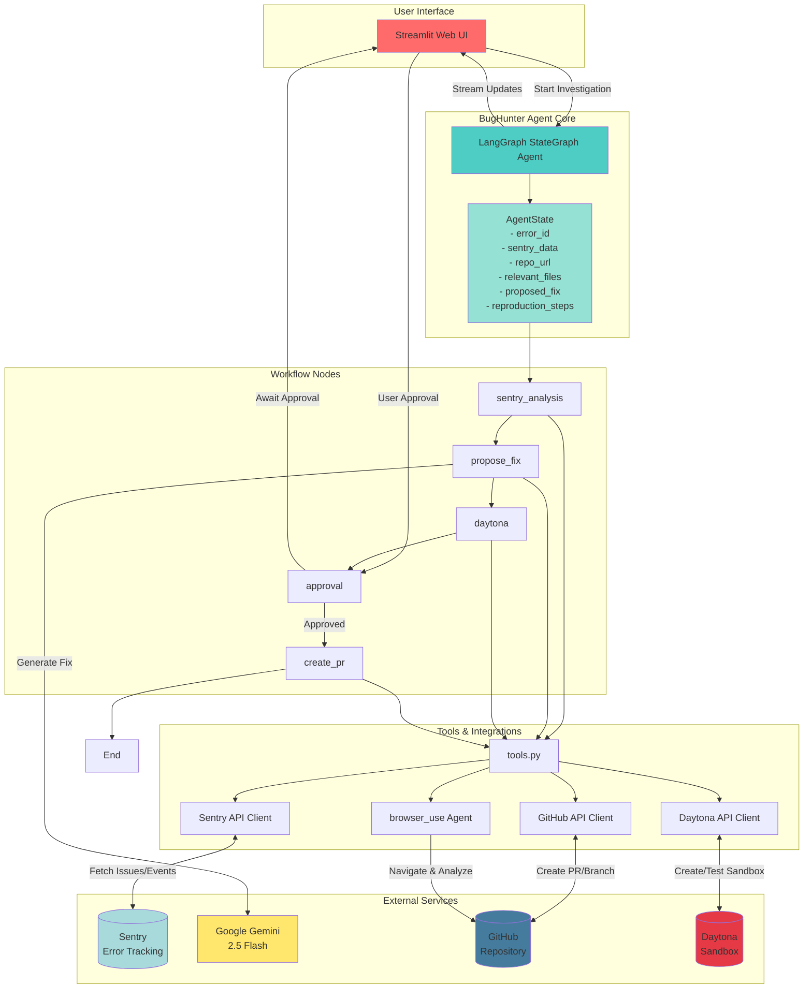
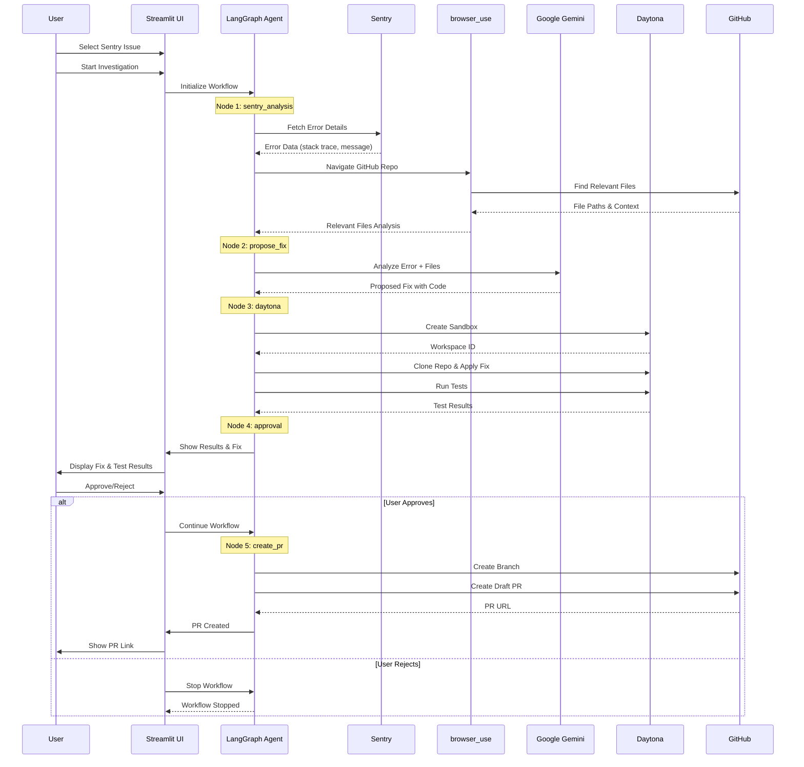

# 🪲 BugHunter Agent – Daytona HackSprint

An AI-powered automated bug fixing agent that analyzes Sentry errors, identifies problematic code, proposes fixes, tests them in a sandbox environment, and creates draft pull requests.

## 🎯 Overview

BugHunter is an intelligent agent that streamlines the bug fixing workflow by:

1. **Fetching Sentry Issues** - Retrieves unresolved errors from your Sentry project
2. **Intelligent File Discovery** - Uses AI browser automation to find relevant files in your GitHub repository
3. **Automated Fix Generation** - Leverages Google Gemini to analyze errors and propose code fixes
4. **Sandbox Testing** - Tests proposed fixes in a Daytona sandbox environment before creating PRs
5. **PR Creation** - Automatically creates draft pull requests with the fixes

## ✨ Features

- 🔍 **Smart Error Analysis**: Automatically analyzes Sentry error data including stack traces, error messages, and metadata
- 🤖 **AI-Powered File Discovery**: Uses `browser_use` to intelligently navigate your GitHub repository and identify problematic files
- 🧠 **Intelligent Fix Generation**: Leverages Google Gemini 2.5 Flash to propose comprehensive fixes with explanations
- 🧪 **Sandbox Testing**: Tests fixes in isolated Daytona sandboxes before deployment
- 🔄 **Automated PR Creation**: Creates draft pull requests with detailed descriptions
- 🎨 **Streamlit UI**: User-friendly web interface for monitoring and controlling the bug fixing process

## 📸 Screenshots

### Main Dashboard and Issue Selection

*The main interface showing Sentry issues, repository configuration and selected issue*

### Proposed Fix

*Gemini-generated fix with explanation and code changes*

### Pull Request Created

*Successfully created draft pull request on GitHub*

> 📝 **Note**: Add your screenshots to the `screenshots/` directory and name them accordingly (e.g., `dashboard.png`, `issue-selection.png`, etc.)

## 🏗️ Architecture

> 📖 **For detailed architecture documentation, see [ARCHITECTURE.md](ARCHITECTURE.md)**

### System Architecture Diagram



### Workflow Sequence Diagram



### Node Descriptions

- **sentry_analysis**: Analyzes Sentry issue data and uses browser automation to find relevant files
- **propose_fix**: Uses Gemini LLM to generate a proposed fix based on error data and relevant files
- **daytona**: Creates a sandbox environment, applies the fix, and runs tests to verify it works
- **approval**: Human-in-the-loop approval step (handled via Streamlit UI)
- **create_pr**: Creates a draft GitHub pull request with the fix

## 📋 Prerequisites

- Python 3.8+
- Sentry account with API access
- GitHub account with repository access
- Daytona account and API key
- Google API key (for Gemini)

## 🚀 Installation

1. **Clone the repository**:
   ```bash
   git clone https://github.com/YashKhairnar/Agies.git
   cd bugHunter
   ```

2. **Create a virtual environment**:
   ```bash
   python -m venv .venv
   source .venv/bin/activate  # On Windows: .venv\Scripts\activate
   ```

3. **Install dependencies**:
   ```bash
   pip install -r requirements.txt
   ```

4. **Set up environment variables**:
   Create a `.env` file in the project root:
   ```env
   # Sentry Configuration
   SENTRY_ORG_SLUG=your-org-slug
   SENTRY_PROJECT_SLUG=your-project-slug
   SENTRY_TOKEN=your-sentry-token

   # GitHub Configuration
   GITHUB_TOKEN=your-github-token
   GITHUB_REPO=https://github.com/username/repo-name

   # Google/Gemini API
   GOOGLE_API_KEY=your-google-api-key
   # OR
   GEMINI_API_KEY=your-gemini-api-key

   # Daytona Configuration
   DAYTONA_API_KEY=your-daytona-api-key
   DAYTONA_API_URL=https://app.daytona.io/api
   DAYTONA_TARGET=us
   ```

## 🎮 Usage

1. **Start the Streamlit app**:
   ```bash
   streamlit run main.py
   ```

2. **In the web interface**:
   - The app will display your configured GitHub repository
   - Click "🔄 Fetch Sentry Issues" to retrieve unresolved errors
   - Select an issue from the dropdown
   - Click "Start Investigation" to begin the automated fixing process

3. **Review the process**:
   - The agent will analyze the error and find relevant files
   - A proposed fix will be generated by Gemini
   - The fix will be tested in a Daytona sandbox
   - Review the test results and approve or reject the fix

4. **Approve and create PR**:
   - Click "✅ Approve & Create Draft PR" to create a GitHub pull request
   - Or click "❌ Reject" to stop the workflow

## 📁 Project Structure

```
bugHunter/
├── main.py          # Streamlit UI application
├── agent.py         # LangGraph agent workflow and state management
├── tools.py         # Utility functions for Sentry, GitHub, Daytona, and browser automation
├── .gitignore       # Git ignore rules
└── README.md        # This file
```

## 🔧 Key Components

### Agent Workflow (`agent.py`)
- Defines the state graph and node functions
- Manages the bug fixing workflow orchestration
- Handles state transitions and approvals

### Tools (`tools.py`)
- **Sentry Integration**: Fetches issues and error details from Sentry API
- **Browser Automation**: Uses `browser_use` for intelligent GitHub repository navigation
- **Daytona Integration**: Creates sandboxes and tests code fixes
- **GitHub Integration**: Creates branches and pull requests

### UI (`main.py`)
- Streamlit-based web interface
- Real-time workflow monitoring
- Interactive approval system

## 🔒 Security

- **Never commit `.env` files** - The `.env` file is already in `.gitignore`
- **Rotate API keys** if they are ever exposed
- **Use environment variables** for all sensitive credentials
- **Review all generated code** before merging PRs

## 🤝 Contributing

Contributions are welcome! Please feel free to submit a Pull Request.

## 📝 License

This project was created for the Daytona HackSprint. Check the repository license for details.

## 🙏 Acknowledgments

- Built with [LangGraph](https://github.com/langchain-ai/langgraph)
- Uses [browser-use](https://github.com/browser-use/browser-use) for intelligent web automation
- Powered by [Google Gemini](https://ai.google.dev/) for code analysis
- Integrated with [Daytona](https://daytona.io/) for sandbox testing
- UI built with [Streamlit](https://streamlit.io/)

## 📞 Support

For issues, questions, or contributions, please open an issue on the GitHub repository.

---

**Built with ❤️ for Daytona HackSprint**

